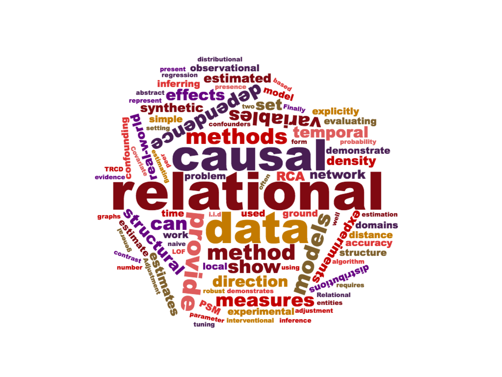

  

The Knowledge Discovery Laboratory (KDL) is a research group in the College of Information and Computer Sciences at the University of Massachusetts Amherst.  We study the foundations of machine learning, develop innovative technologies for exploring and modeling complex data sets, and we apply those technologies to practical tasks in areas such as explainable artificial intelligence, computational social science, management of cyber-physical systems, scientific data analysis, network science, and fraud detection.

Specifically, KDL’s research focuses on constructing causal models of complex systems, a fundamental research challenge at the frontier of machine learning. We study how to infer causal dependence from observational and experimental data.  In particular, we are creating new methods, algorithms, and systems that infer causal dependence from data about complex and time-varying relationships among people, places, things, and events.  One current focus is applying causal models to provide human-understandable explanations of what deep neural networks represent and how they make inferences.

New developments in causal inference are vital because of growing interest in moving beyond simple predictive models, toward models that infer the effects of actions. Such models are critical to designing, managing, and understanding AI systems, the internet, cyber-physical systems, scientific communities, financial systems, social networks, complex software, and other types of complex adaptive systems.

Our research draws on concepts and techniques from a wide variety of technical communities, including machine learning, graphical models, probabilistic programming, statistics, experimental and quasi-experimental design, quantitative social science, database theory, complex adaptive systems, graph theory, and social network analysis.  Our work intentionally spans the spectrum from foundational theory of statistical inference to large-scale empirical evaluation of the resulting algorithms and systems.
